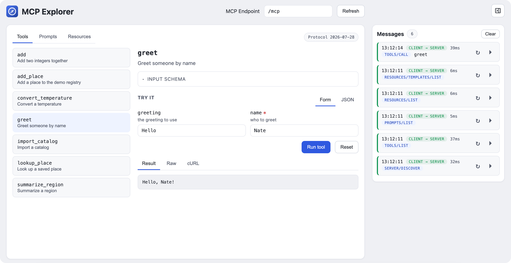

<p align="center">
  
</p>

<h1 align="center">MCP Explorer</h1>

<p align="center">
  <a href="https://www.npmjs.com/package/@refactorful/mcp-explorer"></a>
  <a href="LICENSE"></a>
  <a href="https://github.com/Refactorful/mcp-explorer/actions/workflows/publish.yml"></a>
</p>

An offline single-page debugger for any
[Model Context Protocol](https://modelcontextprotocol.io/) (MCP) server.
MCP Explorer discovers and renders **tools, prompts and resources**, executes
tools through a schema-driven "Try it" form, reads resources, and logs every
JSON-RPC message live so you can see exactly what the server sent back.

Written in **ReScript + React**. No backend and no host dependency: you pass
the MCP endpoint in when you mount it.



## Features

- **Explore any MCP server:** tools, prompts and resources, including
  parameterized resource templates. Tabs appear only when the server
  advertises them.
- **Execute tools:** a schema-driven "Try it" form with Form/JSON toggle,
  `Result` / `Raw` / `cURL` views, and Reset. Nested objects, maps, arrays,
  unions and defaults render as real controls; unrecognized shapes fall back
  to a JSON editor.
- **Streaming:** `text/event-stream` notifications such as progress appear
  live in a "Stream" log before the final result.
- **Message log:** every request with its wire method, timing, direction and
  raw payloads. Replay a request or reopen it in the detail pane.
- **Protocol:** JSON-RPC 2.0, modern `2026-07-28` MCP era (no initialize
  handshake): `server/discover`, then `tools/list`, `prompts/list` and
  `resources/list` when advertised.
- **Navigation:** master-detail split with browser history, collapsing to a
  single pane on narrow screens.

## Install

```sh
npm install @refactorful/mcp-explorer
```

The package ships the prebuilt bundle. Use it as a React component (React 18+
is a peer dependency):

```jsx
import "@refactorful/mcp-explorer/styles.css";
import { McpExplorer } from "@refactorful/mcp-explorer";

<McpExplorer endpoint="/mcp" execEnabled />
```

It accepts `endpoint`, `execEnabled` and `endpointEditable`, plus `className`
for the wrapper element. TypeScript declarations are included.

Or use the imperative global the component wraps:

```js
import "@refactorful/mcp-explorer/styles.css";
import "@refactorful/mcp-explorer/index.js"; // registers window.McpExplorer

window.McpExplorer({ endpoint: "/mcp", domId: "mcp-explorer" });
```

Or load the global from a CDN without installing:

```html
<link
  rel="stylesheet"
  href="https://unpkg.com/@refactorful/mcp-explorer/styles.css"
/>
<script src="https://unpkg.com/@refactorful/mcp-explorer"></script>
```

### Self-hosting

Prefer to serve the files yourself? They live in `bundle/mcpexplorer/` and are
also included in the npm tarball:

| File | Purpose |
| --- | --- |
| `index.js` + `styles.css` | Self-contained IIFE exposing `window.McpExplorer`. This is the embeddable integration. |
| `index.html` | Standalone single-file page that mounts itself. |
| `icon.svg` | App icon, for the host page favicon. |

## Usage

Load the JS and CSS on any page, drop in an empty container, and mount:

```html
<div id="mcp-explorer"></div>
<link rel="icon" href="/icon.svg" type="image/svg+xml" />
<link rel="stylesheet" href="/docs/mcp/styles.css" />
<script src="/docs/mcp/index.js"></script>
<script>
  const viewer = window.McpExplorer({
    endpoint: "/mcp",          // MCP URL (absolute or same-origin path)
    domId: "mcp-explorer",     // id of the container element
    execEnabled: true,         // optional: on in dev, off in production
    endpointEditable: false,   // optional: lock the endpoint field
  });
  // viewer.unmount();
</script>
```

It takes a config object and returns an `{ unmount }` handle. Options:

- **`endpoint`** (alias `url`): the MCP URL to call. Defaults to `"/mcp"`.
- **`domId`** (alias `dom_id`): id of an empty container element. Defaults to
  `"mcp-explorer"`.
- **`execEnabled`**: turns tool execution on or off for this mount. When
  omitted, the build default applies (on in `vite dev`, off in production). It
  is fixed for the lifetime of the mount; there is no in-app toggle.
- **`endpointEditable`**: defaults to `true`. Set to `false` to pin the viewer
  to a single server.

`window.McpExplorer.mount(config)` is the same function, and
`window.McpExplorer("some-dom-id")` is a shorthand where the string is the
`domId`.

### Standalone page

The bundle's `index.html` is a complete single-file page: the JS and CSS are
inlined and the page mounts itself, so serving the file is enough. The mount
call it ships with is:

```js
window.McpExplorer({ endpoint: "/mcp", domId: "root" });
```

Serve the file next to your MCP endpoint (or behind the same proxy) and it
just runs.

## Requirements

- A browser. The viewer is static files, there is no server-side component.
- The MCP endpoint must be reachable from the page that mounts the viewer:
  same origin, behind a proxy, or CORS-enabled. Many MCP hosts reject
  cross-origin requests (`OPTIONS` returns `405`, `POST` with an `Origin`
  header returns `403`), so serving the viewer alongside the endpoint is the
  happy path. The dev server proxies `/mcp` and strips `Origin` for you.
- Node.js 20+ to build from source (not needed to use the bundle).

## Development

```sh
npm install

npm run res:watch   # terminal 1: ReScript compiler in watch mode
npm run dev         # terminal 2: Vite dev server (proxies /mcp)

npm test            # unit + DOM/SSR tests
npm run bundle      # rebuild bundle/mcpexplorer/*
npm run validate:live               # live smoke test against a running server
MCP_ENDPOINT=http://127.0.0.1:8080/mcp npm run validate:live
```

In dev, the viewer proxies `/mcp` to `http://127.0.0.1:8080` (override with
`MCP_DEV_TARGET`). Keep the endpoint relative: an absolute URL bypasses the
proxy and fails as a cross-origin request.

### Releases

Publishing is version-driven, so you never tag by hand. Bump the version,
commit, and push to master:

```sh
npm version patch --no-git-tag-version
git add package.json package-lock.json
git commit -m "release 0.1.2"
git push
```

The Publish workflow derives `v<version>` from package.json and skips versions
that already have a tag, release, or npm version. Otherwise it runs the tests,
publishes to npm with provenance, and creates a GitHub release with the bundle
zip attached.

## Layout

```
src/                  ReScript app (Main.res = API, Embed.res = React entry, App.res = shell)
src/api/              protocol, codecs, transport, SSE, schema
src/components/       one React component per file
test/                 Vitest unit tests + jsdom/SSR tests
scripts/              copy-bundle, validate-live
bundle/mcpexplorer/   generated build artifacts (rebuilt by npm run bundle)
```

## Notes

- The wire protocol is strongly typed: method/header mismatches are
  unrepresentable, decoders return `result` instead of `undefined`, and unknown
  content-block types degrade gracefully rather than failing a call.
- Versions are pinned exactly: `rescript` 12.3.1, `@rescript/react` 0.15.0,
  React 19.2.0, Vite 8.3.1, Vitest 5.0.2.

## License

MIT. See [LICENSE](LICENSE). Copyright (c) 2026 Refactorful (Nathan Ortega).
